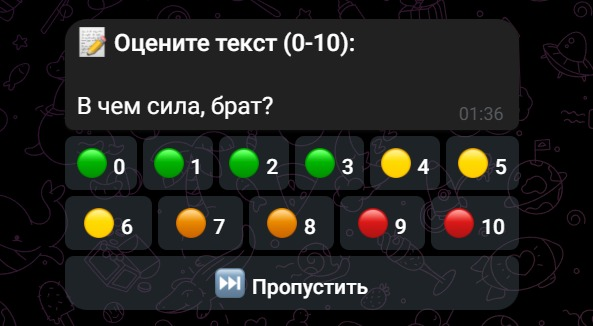

# Telegram Data Labeling Bot



Telegram-бот для совместной разметки текстовых данных. Разметчики оценивают тексты по шкале 0-10, результаты экспортируются в CSV для обучения модели.

## Стек

- Python 3.12, aiogram 3.x (async polling)
- PostgreSQL 16 + SQLAlchemy 2 (async)
- Redis 7 (блокировки задач)
- polars + py7zr (импорт/экспорт `.7z`)
- Docker Compose

## Быстрый старт

```bash
cp .env.example .env
```

Заполните `.env`:

| Переменная | Описание |
|---|---|
| `BOT_TOKEN` | Токен бота от [@BotFather](https://t.me/BotFather) |
| `BOT_ADMIN_IDS` | JSON-список Telegram ID администраторов, напр. `[123456789]` |
| `BOT_DATABASE_URL` | Строка подключения к PostgreSQL (по умолчанию указывает на контейнер) |
| `BOT_REDIS_URL` | URL Redis (по умолчанию указывает на контейнер) |

```bash
docker compose up --build
```

## Команды бота

### Для всех пользователей

| Команда | Описание |
|---|---|
| `/start` | Получить задачу на разметку (или повторно показать текущую) |
| `/stats` | Личная статистика: размечено / пропущено |

### Для администраторов

| Команда | Описание |
|---|---|
| Отправить `.7z` файл | Импорт текстов из CSV внутри архива (столбец `text`) |
| `/export` | Экспорт размеченных данных в `dataset_export.7z` |
| `/admin user add <id>` | Добавить пользователя в whitelist |
| `/admin admin add <id>` | Добавить администратора |
| `/admin stats` | Глобальная статистика: всего / размечено / осталось, по пользователям |

## Процесс разметки

1. Администратор отправляет `.7z` архив с CSV (обязательный столбец `text`).
2. Разметчик вводит `/start` и получает текст с inline-клавиатурой (0-10, Пропустить).
3. После оценки или пропуска автоматически выдаётся следующая задача.
4. Задача блокируется в Redis на 15 минут. Зависшие блокировки сбрасываются фоновой задачей.
5. Администратор экспортирует результаты через `/export`.

## Структура проекта

```
bot/
├── __main__.py        # Точка входа
├── config.py          # Настройки (pydantic-settings)
├── keyboards.py       # Inline-клавиатура оценки
├── db/
│   ├── models.py      # User, Item, Label
│   └── session.py     # async engine + sessionmaker
├── handlers/
│   ├── admin.py       # Импорт, экспорт, управление доступом
│   └── labeling.py    # /start, оценка, /stats
├── middlewares/
│   └── auth.py        # Whitelist-проверка
└── services/
    ├── cleanup.py     # Сброс зависших блокировок
    ├── data.py        # import_from_7z / export_to_7z
    ├── items.py       # get_next_task / complete_task
    ├── lock.py        # Redis lock helpers
    └── redis.py       # Redis connection
```
